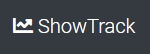

# Show Tracker

​
#### Created On: 08/18/2020  

Link to the working product: https://tranquil-waters-31767.herokuapp.com/
​
## Creators
Sulayman Sallah- html/css/js/Unogs API via RapidAPI/Node.js/Express/MySQL/Sequelize
Andrew Raines-   html/css/js/Node.js/Express/Handlebars/Heroku/MySQL/Sequelize
Bashkim Ereqi-   html/css/js
​
## Description and Features
Show Tracker is a social network application that allows users to add, collect, and rate shows or movies they have finished, are currently watching, and plan to watch in the future. Show Tracker also allows users to interact with each other through the discussion feature and global feed.

## Support and contact details
​
Sulayman Sallah- github.com/Saulstice
Andrew Raines-   github.com/rainesand
Bashkim Ereqi- ​  github.com/bashkimereqi100

## Technologies Used
​
Javascript/jQuery  
HTML5  
CSS3
Bootstrap
Node.js
Express
Heroku
MySQL
Sequelize
Unogs API via RapidAPI
Handlebars

### License
​
Copyright(c) 2020 By Andrew Raines
​
This software is licensed under MIT license.
